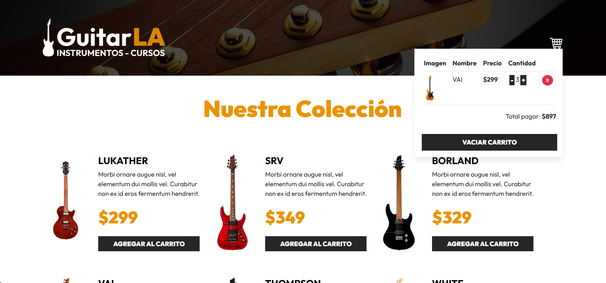

# 🎸 GuitarLA - React Project

This project is part of the **React & TypeScript – La Guía Completa** course by **Juan de la Torre (Udemy)**.  
It’s a single-page React application that simulates an online guitar store. The goal of this project is to practice **state management**, **component structure**, and **performance optimization** using core React hooks such as `useState`, `useEffect`, and `useMemo`.

---

## 🚀 Features

- **Dynamic product rendering:** Displays a list of guitars loaded from a data file.
- **Shopping cart system:** Allows users to add guitars to the cart with quantity and price tracking.
- **Cart management:** Users can increase, decrease, or remove items directly from the cart.
- **Live total calculation:** The cart’s total updates automatically based on the selected items.
- **Optimized performance:** Uses `useMemo` to prevent unnecessary recalculations.
- **Component-based UI:** Built entirely with modular React components.
- **Bootstrap styling:** The layout and styling are based on pre-provided HTML and Bootstrap CSS from the course.

---

## 🧠 Key Concepts Practiced

- React hooks: `useState`, `useEffect`, `useMemo`
- Component communication via props
- Functional state updates
- Conditional rendering
- Array manipulation and mapping
- Event handling in React
- Code organization and modular design

---

## 🛠️ Technologies Used

- **React 18**
- **Vite**
- **JavaScript (ES6+)**
- **Bootstrap**
- **HTML & CSS (provided by the course)**

---

## 🧩 Project Structure

```
GuitarLA/
├── src/
│   ├── components/
│   ├── data/
│   ├── assets/
│   ├── App.jsx
│   └── main.jsx
├── public/
├── index.html
├── package.json
└── vite.config.js
```

---

## ⚙️ Installation & Setup

1. Clone this repository:
   ```bash
   git clone https://github.com/lorelvis-santos/guitarla-react.git
   ```
2. Navigate into the project folder:
   ```bash
   cd guitarla-react
   ```
3. Install dependencies:
   ```bash
   npm install
   ```
4. Run the development server:
   ```bash
   npm run dev
   ```

The app will be available at **http://localhost:5173**

---

## 📸 Preview

__

---

## 📚 Credits

This project was created as part of the **React & TypeScript Course by [Juan de la Torre](https://www.udemy.com/user/juanpablodelatorrevaldez/)**  
Customized and adapted by **Lorelvis Santos** for learning purposes.

---

## 📝 License

This project is for educational purposes only and is **not intended for commercial use**.